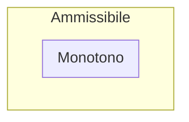

E' una [[Intelligenza Artificiale#Strategie di Ricerca Informate|Strategia di Ricerca Informata]] che come funzione di valutazione utilizza una
$$f(n) = g(n) + h(n)$$
dove:
- $g(n)$: costo minimo per raggiungere il nodo $n$ dal nodo $i$, secondo le informazioni attualmente disponibili, perché si potrebbe trovare nelle successive iterazioni della ricerca un percorso alternativo con costo minore
- $h(n)$: la funzione *Euristica*

A* introduce una nuova funzione
$$f^{star}(n) = g^{star}(n) + h^{star}(n)$$

che, sebbene sia identica nella forma dalla *funzione di valutazione*, restituisce come valore il
**costo minimo reale per raggiungere un nodo target da $i$ passando per $n$** dove:
- $g^{star}(n)$: costo minimo per raggiungere il nodo $n$ a partire dallo stato iniziale $s$, considerando tutti i cammini possibili
- $h^{star}(n)$: costo minimo reale del proseguimento di percorso che consente di raggiungere un goal preferito a partire dal nodo $n$
- $f^{star}(n)$: costo minimo per raggiungere un goal preferito di $n$ da $s$

![[f-star-knowledge.png]]

# Implementazione in Pseudo-Codice
- Segna $s_i$ come $Aperto$, calcola $f(s)$
- Seleziona il nodo $Aperto$ $n$ con $f(n)$ **minima** (nel caso di pari merito, si prediligono gli stati target, se non ve ne sono se ne prende uno qualsiasi) 
- Se $n\in T$ marca $n$ come $Chiuso$, termina l'esecuzione
- Se $n\notin T$ marca $n$ come $Chiuso$, applica $f_s(n)$ e genera i suoi successori $n_s$
  - Calcola $f(n_s)$ per ogni successore
  - Marca $Aperto$ i successori $n_s$ che **NON** sono $Chiuso$
  - Rimarca $Aperto$ i successori $n_s$ marcati $Chiuso$ se e solo se ha calcolato una $f(n_s) <$ della precedente 
# Criteri di valutazione della strategia di ricerca
Si è dimostrato che quando A* lavora su alberi di ricerca e:
1. L'Euristica $h$ è [[Euristica Ammissibile|Ammissibile]]
2. Per ogni passo $a$, $f_c(a)>0$
allora valgono le seguenti valutazioni per *Completezza* e *Ottimalità*.

- **Completezza**: **SI**
- **Ottimalità**: **SI**
- **Complessità temporale**: $O(b^{d})$ dove
  - $b$: branching factor
  - $d$: profondità minimale del goal
- **Complessità spaziale**: $O(b^{d})$ perché tutti i nodi della frontiera e tutti i loro antenati vanno mantenuti in memoria

**N.B.** Se tutte le azioni hanno **costo uniforme pari a 1**, [[A-star]] diventa una [[Ricerca in ampiezza]].

**A-star** è detto **OTTIMAMENTE EFFICIENTE**: è stato dimostrato che non esiste nessun altro algoritmo ottimo che garantisca di espandere meno nodi di A*.  

## Dimostrazione Ottimalità con Alberi
Sapendo che A* è *Completo*, vogliamo dimostrare che A* sia *Ottimale* quando lavora su Alberi di Ricerca.
Supponiamo di aver raggiunto $G2$, *subottimo*.
A* deve essere in grado di raggiungere $G$, *ottimo*.

![[a-star-optimal-1.png]]
![[a-star-optimal-2.png]]

## Dimostrazione Ottimalità con Grafi
Utilizzando i grafi è necessario introdurre una condizione più stringente attraverso la seguente **Disuguaglianza Triangolare**:
$$\forall n, n', \text{  }h(n)\leq c(n,n',a) + h(n')$$
dove:
- $c(n,n',a)$: costo per andare da $n\rightarrow n'$ tramite l'azione $a$

Una euristica che rispetta la **Disuguaglianza Triangolare** è detta **Euristica Consistente o Monotona**.
Se una euristica è *Consistente* **i costi $f(n)$ lungo il cammino sono** **non decrescenti**.

**N.B.**  $h(n)=0$ per la definizione di [[Euristica Ammissibile|Ammissibilità]] è ammissibile, ma **NON E' INFORMATIVA**: permetterebbe di valutare solo il costo del percorso fatto per raggiungere il nodo $n$.