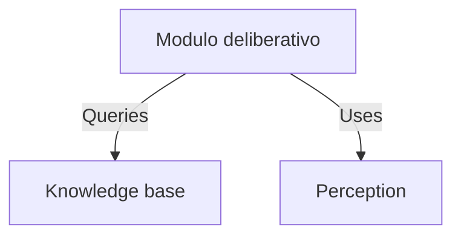
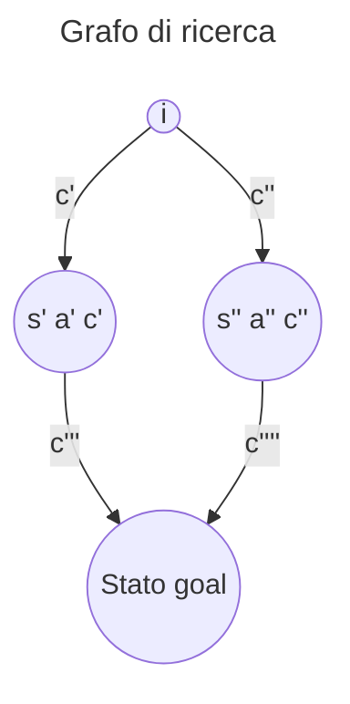
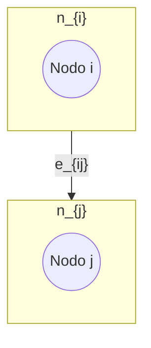
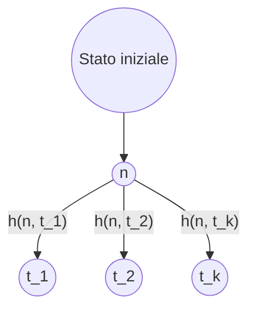

L'intelligenza artificiale deriva dall'unione di due parole:
1. Intelligenza: complesso di facoltà psichiche e mentali che consentono all’uomo di pensare, comprendere o spiegare i fatti o le azioni, elaborare modelli astratti della realtà, intendere e farsi intendere dagli altri, giudicare, e lo rendono insieme capace di adattarsi a situazioni nuove e di modificare la situazione stessa quando questa presenta ostacoli all’adattamento;
2. Artificiale: **ottenuto in maniera non naturale, con procedimenti tecnici**
## Automazione o Intelligenza?
E' bene distinguere la differenza che intercorre tra automazione e intelligenza.
L'automazione deriva dalla scrittura di programmi che **tutto prevedono e tutto gestiscono**: trattano un "ambiente chiuso" nel quale possono capitare solo alcuni eventi, gestibili in maniera totalmente sequenziale. Basti pensare ai [DFA](https://en.wikipedia.org/wiki/Deterministic_finite_automaton).
1. Lavatrice intelligente: non ci verrebbe mai in mente di considerare una lavatrice intelligente realmente tale. Questo perché la lavatrice fa ricadere tutti gli eventi possibili in un particolare caso gestito, come potrebbe essere lo sportello aperto oppure un carico eccessivo.
2. Rover di Marte: ha una capacità aggiuntiva rispetto alla lavatrice, cioè quella di avere un minimo di "**autonomia**". Il segnale tra il Rover e la base terrestre ha una latenza di 20 minuti, non si può pensare ad un semplice radiocomando, il Rover deve essere capace di gestire autonomamente casi come terreno scosceso o presenza di ostacoli nel percorso stabilito.
3. Assistenti virtuali e ChatGPT: sono multipurpose, riescono a gestire eventi in maniera non hardcodata e prevista dal programmatore. Sono scritti in maniera sostanzialmente differente rispetto ai programmi tradizionali.

###### Come stabilire se qualcosa è intelligente?
1. **Test di Turing**: la macchina deve riuscire a produrre gli output attesi.
   Vi è un intervistatore e dall'altra parte una entità sconosciuta (non sa se è umano o una macchina), e l'intervistatore dovrà decretare dopo avergli fatto arbitrarie domande, se quest'ultima sia umano o macchina. Se l'entità sconosciuta è una macchina e l'intervistatore dice "umano", allora la macchina ha superato il test di Turing.
   Il progresso tecnologico ha portato a considerare il test di Turing eccessivamente limitato per poter conferire il titolo di intelligenza ad una macchina in quanto non considera l'**[[Intenzionalità]]**.
2. **[[Intenzionalità#Esperimento della Stanza Cinese |Esperimento della Stanza Cinese]]**: proposto da [John Searle](https://en.wikipedia.org/wiki/John_Searle), aggiunge un livello di complessità aggiuntivo basato sull'[[Intenzionalità]].
   "Il fatto che di fronte agli stessi input un uomo e un computer producano lo stesso output significa che entrambi capiscono cosa stanno facendo"?

Una curiosità è che quotidianamente siamo sottoposti al **Test di Turing inverso** attraverso i **C.A.P.T.C.H.A.** *(Completely Automated Public Turing-test to tell Computers and Humans Apart)*.

## Strong e Weak AI
L'intervento di [John Searle](https://en.wikipedia.org/wiki/John_Searle) ha spaccato la comunità dell'Intelligenza Artificiale in due branchie:
- **Strong AI**: si pone la questione di ottenere la riproducibilità dell'intelligenza umana in quanto tale. Si è sviluppata molto al di fuori del semplice contesto matematico e informatico, andando a coinvolgere discipline quali sociologia, psicologia, ..., andando a configurarsi come una disciplina a parte come **Scienze Cognitive**.
- **Weak AI**: si pone la questione di risolvere problemi che, se risolti dagli esseri umani, richiederebbero intelligenza. E' detta **task-oriented**, e si concentra nello studio del pensiero e del **comportamento razionale** che l'uomo assume di fronte alla soluzione di uno specifico problema.

## Agenti e Ambienti
Gli agenti e gli ambienti sono dei concetti fondamentali per poter studiare approfonditamente la disciplina dell'Intelligenza Artificiale e sono un binomio *<Agente, Ambiente>*.
Perché sono un binomio imprescindibile? Perché un agente può essere particolarmente adatto per un determinato ambiente rispetto ad un altro.
### Agente
Un agente è astrattamente composto da 3 componenti principali:
- **Sensori**: permettono di percepire segnali dall'ambiente in cui si trova. Un esempio software è quello di percepire dati, ambiente in questo caso virtuale.
- **Funzione deliberativa**: sulla base delle informazioni ottenute grazie ai sensori, decide cosa fare.
- **Attuatori**: permettono di agire all'interno dell'ambiente in cui si trova. Un esempio possono essere i freni di un'auto intelligente.
Un agente esegue costantemente un ciclo sequenziale come il seguente:
 1. Percepisco
 2. Delibero
 3. Agisco
### Ambiente
Un ambiente è astrattamente composto da 3 caratteristiche principali:
1. **Osservabilità**:
   - **Completamente osservabile**: i sensori hanno accesso a tutti gli aspetti dell'ambiente per deliberare quale azione eseguire
   - **Parzialmente osservabile**: i sensori danno accesso solo a parte delle informazioni rilevanti per poter deliberare un'azione (imprecisione dei sensori o impossibilità di reperire queste info)
2. **Determinismo**:
   - **Deterministico**: lo stato successivo è determinato dallo stato corrente e dall'azione eseguita, come nei [DFA](https://en.wikipedia.org/wiki/Deterministic_finite_automaton).
   - **Stocastico**: lo stato successivo può differire pur avendo lo stesso stato ed eseguendo la medesima azione. E' detto **strategico** se l'ambiente è stocastico solo sulla base delle azioni eseguite da altri agenti all'interno dell'ambiente.
3. **Staticità**:
   - **Statico**: l'ambiente non cambia mentre l'agente sta deliberando quale azione eseguire
   - **Dinamico**: l'ambiente può cambiare mentre l'agente sta deliberando quale azione eseguire
4. **Numero degli agenti**:
   - **Singolo agente**: viene modellato come singolo agente una sola entità
   - **Multiagente**: vengo modellate entità multiple come agente
 
Un esempio di ambiente sarebbe quello di una strada con attraversamento pedonale.
Un esempio di agente sarebbe un uomo che cerca di attraversare la strada.
L'uomo in questo contesto deve effettuare moltissime valutazioni:
- Identificare il passaggio pedonale
- Rilevare possibili ostacoli
- Rilevare oggetti in movimento
- Rilevare segnali significativi come la luce semaforica
- Costruire un piano di azione, quali attraversare, magari fermarsi un attimo perché una macchina non dà la precedenza
L'ambiente è:
- Complesso (moltissimi altri attori presenti, auto, bici, altri pedoni, ...)
- Parzialmente previdibile (è possibile prevedere la velocità delle macchine, il tempo rimanente della luce verde, ...)
- Parzialmente collaborativo (vige il Codice della Strada, ma non è detto che tutti lo rispettino sempre e questo richiede prudenza aggiuntiva)

## Approccio al Design di Intelligenza Artificiale
L'approccio tradizionale alla programmazione, imperativo e a oggetti, non è adatto alla scrittura di software: è adatto a svolgere un singolo compito e ruota attorno al **come adempierlo in una sequenza di passi**.
```c++
list ins_ord(list L, int dato) {
 if (!L) return(crea_nodo(dato));
 else if (L->d < dato) {
 L->next =
 ins_ord(L->next, dato);
 return L;
 }
 else {
 list tmp = crea_nodo(dato);
 tmp->next = L;
 return(tmp);
 }
}
```

L'approccio adatto all'AI software è quello del **paradigma dichiarativo** e ruota attorno al **cosa so per poter deliberare come agire a riguardo**.
Lo stesso programma quindi è utilizzabile in molteplici situazioni differenti e la percezione è integrata con la base di conoscenze di quest'ultimo.
**E' potente perché l'algoritmo può essere lo stesso, ma la conoscenza può essere totalmente diverso anche in termini di dominio**. (Per esempio, l'algoritmo del [[Mondo Giocattolo]] potrebbe essere tranquillamente utilizzabile anche per decidere la strada per andare da Torino a Catania).


   
Un agente percepisce la situazione iniziale e resta in attesa, non facendo nulla, di ricevere un **goal** (obiettivo) da raggiungere.
Una volta ricevuto il goal, costruisce i passi con i quali andare dalla situazione iniziale a quella desiderata.
Attraverso la **Knowledge Base**, viene a conoscenza delle azioni che può effettuare e di come queste alterino l'ambiente all'interno del quale si trova.
Le azioni sono descritte sulla base di **quando sono applicabili** e **gli effetti sull'ambiente**.

La ricerca del percorso per raggiungere la situazione desiderata richiede la capacità di **ragionamento**, cioè quella di scegliere l'azione utile, tra quelle applicabili, per avvicinarsi all'obiettivo.
**Problema dell'Ottimalità**: noi non vogliamo una soluzione utile, ma la vogliamo in tempi rapidi e che sia efficiente! Questo problema è estremamente non banale.
### Da automazione ad autonomia
- **Automazione**: ormai è standard in molteplici attività, impone che si debba programmare il device a fare ogni passo e gestire ogni caso, ed è applicabile in domini fortemente ripetitivi.
- **Autonomia**: un agente artificiale riceve dei compiti e/o goal ad alto livello, l'utente demanda quindi all'agente la risoluzione.

---
# Risoluzione Automatica dei Problemi
La risoluzione automatica dei problemi coinvolge diverse discipline:
- Ricerca nello spazio degli stati
- Problemi con avversario
- Problemi di soddisfacimento di vincoli
- Inferenza Logica
**La realtà che si vuole trattare con tecniche di risoluzione automatiche di problemi deve poter essere astratta in stati tra i quali transire**.

- **Stato**: condizione corrente
- **Transazione**: passaggio di stato da uno corrente al successivo attraverso un'azione.
  Se esiste uno stato dal quale una stessa azione porta a stati differenti, si parla di *non determinismo*.
- **Obiettivo**: stato che si vuole raggiungere. Ogni stato obiettivo è equivalente a tutti gli altri. Opzionalmente è possibile introdurre anche un valore di prestazione o costo per ottenere una soluzione ottimale.
  L'**Insieme degli Stati Obiettivo** è composto da tutti gli stati che godono della proprietà di essere obiettivo.
- **Percorso**: sequenza di transizione da uno stato iniziale ad uno stato obiettivo.
- **Funzione Costo**: valore associato ad ogni possibile transizione che ci permette di ordinare le soluzioni. E' utilizzata per determinare il percorso minimo, ovvero quello più efficiente tra i possibili percorsi.

E' bene non confondere la soluzione con il goal: se il goal fosse che da Torino si vuole raggiungere una località di mare, Genova fa parte degli stati obiettivo, ma la soluzione non è Genova, bensì il percorso da Torino a Genova.

## Istanza di un problema
Un problema è definito come la seguente n-upla:
$$ <s_i, f_s, t_o, f_c> $$ dove:
- $s_i$ rappresenta lo **stato iniziale**
- $f_s$ rappresenta la **funzione successore** $f_s(s,a) = s'$, dove $s$ stato e $a$ azione.
- $t_o$ rappresenta il **test obiettivo**, funzione che ci informa se uno stato è obiettivo.
- $f_c$ rappresenta la **funzione costo** $f_c(s,a) = c$
Un esempio di problema utile per consolidare il concetto di istanza di un problema è quello del [[Mondo dell'Aspirapolvere]].
Nel corso tratteremo solo ambienti statici e deterministici.

## Algoritmi e Strutture Dati di Ricerca di una Soluzione
Gli algoritmi di ricerca di una soluzione sono suddivisi in due categorie:
- **Algoritmi Blind**: l'unica informazione della quale dispongono è la descrizione del problema, lo stato iniziale.
- **Algoritmi Informati**: hanno una piccolissima conoscenza in più rispetto agli algoritmi blind, ma sono estremamente più performanti e veloci grazie a quest'ultima.
Le **strutture dati per la ricerca** sono:
- **Alberi di ricerca**
- **Grafi di ricerca**
### Albero / Grafo di Ricerca
E' stato utilizzato come mondo di riferimento quello del [[Gioco del 9]].
Data una particolare configurazione della scacchiera di gioco, per esempio quella iniziale del problema, è logico dire quindi che questo sia uno **stato**.
**Uno stato del problema NON corrisponde ad un nodo della struttura di ricerca**.
Uno **stato** mantiene esclusivamente le informazioni relative alla logica di gioco.
Un **nodo** ha più informazioni rispetto ad uno stato:
- Stato al quale si riferisce
- Costo successori
- Riferimento ai "nodi genitori"
- Riferimento ai nodi successivi

![[search-tree.drawio.png]]



Il grafo di ricerca è una struttura più generica, e può dare vita a più sequenze di soluzione per raggiungere un determinato nodo target.
**Soluzione ottima**: sequenza di azioni che portano dallo stato iniziale ad uno stato goal con il costo minimo.
N.B. **Soluzione ottima non significa necessariamente percorso minimo**:
si può avere una soluzione ottima con tanti passi di costo basso rispetto ad una soluzione con pochi passi di costo maggiore complessivamente.

### Definizione di Grafo
$$ G = (\{n_i\}, \{e_{ij}\})$$
dove:
- $n_i$ : nodo generico
- $e_{ij}$ : arco 


Ogni arco $e_{ij}$ ha associato un costo $c_{ij}$.
Inoltre, gli archi sono diretti e quindi l'esistenza di un arco da A verso B non implica che ve ne sia uno da B verso A.
$$ \exists e_{l_m} \in \{e_{ij}\} \neg\Rightarrow \exists e_{ml} \in e_{ij}$$
All'interno di un grafo di ricerca vi sono diversi **stati di nodi**:
- **Nodo creato**: nodo che il nostro algoritmo ha creato in memoria, ma non ha ancora visitato
- **Nodo esplorato**: nodo che il nostro algoritmo ha già valutato

L'insieme dei nodi non esplorati visitabili da quelli che abbiamo esplorato è detto **frontiera**.

## Strategie di ricerca di una soluzione
Le strategie di ricerca sono degli approcci con i quali possiamo andare a ricercare delle soluzioni.
### Schemi di strategia di ricerca
Si parla di schemi di strategia in quanto forniscono delle strategie ad altissimo livello, i quali passi possono essere implementati in maniera estremamente variegata.
- **Ricerca-Albero *(problema)***: ritorna come valore una soluzione, oppure fallimento se non ne esistono.
  ```
  LOOP DO
	  IF (frontiera vuota) THEN RETURN fallimento
	  SCEGLI NODO DALLA FRONTIERA
	  IF (nodo contiene stato obiettivo) THEN RETURN soluzione
	  ESPANDI IL NODO SCELTO
	  AGGIUNGI I NODI SUCCESSORI DI QUELLO SCELTO ALLA FRONTIERA
  ENDLOOP
  ```
  La scelta del nodo scritta in modo così generico ci dà l'idea che possiamo implementare come più ci aggrada questa operazione.

### Confronto di strategie
Questi sono i criteri con i quali le strategie di ricerca di una soluzione vengono valutati.
- **Completezza**: riesce, SEMPRE, a trovare una soluzione qualora ve ne .fossero
- **Ottimalità**: riesce a dare, SEMPRE, una soluzione ottima
- **Complessità spaziale** in termini di memoria
- **Complessità temporale** in termini di tempo di esecuzione

Le strategia di ricerca sono suddivise inoltre in due tipologie:
1.  **Blind**: l'unica informazione è la descrizione del problema $<s_i, f_s, t_o, f_c>$ 
2. **Approcci informati**: utilizzano la descrizione del problema + **ulteriore conoscenza per guidare la ricerca *(euristica)*** e possono essere:
   - **Monoagente**: ad agente singolo
   - **Multiagente** o **con avversario**
   - **CSP**: **C**onstraint **S**atisfaction **P**roblem

La scrittura della strategia di ricerca può essere effettuata tramite la tradizionale programmazione imperativa, in quanto, per esempio, si tratta semplicemente di realizzare un algoritmo che esplora in ampiezza un albero, come vedremo.
La conoscenza rappresenta, nella forma base, la rappresentazione di un problema nella forma $<s_i, f_s, t_o, f_c>$. 
Una volta sviluppata la strategia di ricerca, possiamo riutilizzarla per i più disparati problemi a patto che riusciamo a tradurli in un modello di conoscenza nella forma $<s_i, f_s, t_o, f_c>$ , dove ci si aspetta di trovare una sequenza di passi per raggiungere l'obiettivo.


## Strategie Blind
Le strategie blind principali sono le seguenti:
- **[[Ricerca in ampiezza]]**
- **[[Ricerca a costo uniforme]]**
- **[[Ricerca in profondità]]** *con o senza Backtracking*
- **[[Iterative Deepening]]**
- **[[Ricerca bidirezionale]]**
## Strategie di Ricerca Informate
Sono delle strategie di ricerca che ambiscono ad ottenere **soluzioni ottime in modo efficiente**, e hanno a disposizione la seguente conoscenza:
- **Istanza del problema**: $<s_i, f_s, t_o, f_c>$
- **Euristica**: funzione $h(n, t) = v$, da *heuristics*, dalla quale otteniamo $h(n) = v$, dove
  -  $n$ è un nodo qualsiasi dell'albero/grafo di ricerca
  - $t$ è un nodo target
  - $v$ è una stima del costo per andare da $n\rightarrow t$


$$h(n)=min_i\text{ } h(n,t_i)$$
Sono detti **nodi preferiti di $n$** quei nodi target $t$ per cui il costo stimato è minimo.
Grazie all'*Euristica* avremo quindi una guida per raggiungere in modo efficiente delle soluzioni ottime.

E' detta strategia di ricerca informata una strategia di ricerca che **applica ai nodi della frontiera una funzione di valutazione** $f(n)$. *(La quale può utilizzare internamente anche l'euristica)*

Ne esistono di diverse, noi tratteremo:
- [[Ricerca Greedy]]
- [[A-star]]
- [[RBFS]]
### Funzioni Euristiche
Le funzioni euristiche possono essere:
- [[Euristica Ammissibile|Ammissibili]]: ottimistiche rispetto al costo reale
- **Informative**: per esempio $h(n)=0$ per la definizione di [[Euristica Ammissibile|Ammissibilità]] è ammissibile, ma **NON E' INFORMATIVA**: permetterebbe di valutare solo il costo del percorso fatto per raggiungere il nodo $n$.
- **Consistenti o Monotone**: rispettano la Disuguaglianza Triangolare $\forall n, n', \text{  }h(n)\leq c(n,n',a) + h(n')$


Le funzioni euristiche possono essere più adatte rispetto ad altre in termini di efficienza.

Un esempio potrebbe essere quello del Gioco dell'8.
Proponiamo due euristiche, entrambe [[Euristica Ammissibile|ammissibili]] per risolvere il problema:
- $h_1$: numero di tessere fuori posto rispetto al goal
- $h_2$: distanza di Manhattan, e cioè il numero di spostamenti che la tessera deve fare verticalmente e orizzontalmente per raggiungere la sua posizione desiderata all'interno del goal

e le compariamo in termini di *nodi generati* con l'[[Iterative Deepening]].

| d   | id      | $A* \ h_1$ | $A* \ h_2$ |
| --- | ------- | ---------- | ---------- |
| 2   | 10      | 6          | 6          |
| 4   | 112     | 13         | 12         |
| 6   | 680     | 20         | 18         |
| 8   | ...     | ...        | ...        |
| 10  | ...     | ...        | ...        |
| 12  | 3644025 | 227        | 73         |
| ... | ...     | ...        | ...        |
| 22  | ...     | 18094      | 1219       |
| 24  | ...     | 39135      | 1641       |

E' detta **funzione euristica dominante rispetto ad un'altra** quella *funzione euristica* $h_2$ rispetto ad $h_1$ per cui vale
$$\forall n\ h_1(n)\leq h_2(n)$$
Una funzione dominante è anche detta **più informativa** rispetto ad altre.

Se non si vuole dimostrare in maniera così estensiva, andando a comparare i dati in maniera tabellare tra le funzioni euristiche, è possibile andare a reperire semplicemente la funzione dominante in un insieme di funzioni euristiche in questo modo.

Siano $h_1, h_2,...,h_k$ euristiche ammissibili per un certo problema se:
$$\forall n\ h(n)=\text{MAX}\{h_1(n), h_2(n), ..., h_k(n)\}$$
$h(n)$ è l'**euristica dominante** su $h_1, h_2,...,h_k$

La ricerca di un'euristica valida per un problema può essere ardua, è possibile quindi trovare un'euristica per una **versione rilassata di un problema**: una versione dove i vincoli del problema sono attenuati o rimossi (E.G.: nel gioco dell'8 i movimenti delle tessere sono limitati dallo spazio libero).
Una soluzione ottima di un problema rilassato è ammissibile anche per il problema con i vincoli. 
### Branching Factor effettivo
Supponiamo di avere eseguito A* generando $N$ nodi, e avendo  
Supponiamo di avere eseguito A* su un certo problema, siano:
- $N$: numero di nodi generati a partire da un nodo iniziale
- $d$: profondità della soluzione trovata

$b$* è  il **branching factor di un albero uniforme di profondità d che contiene N+1 nodi**.

E' utilizzato per valutare la bontà di una *funzione euristica*, è un numero reale che più si avvicina a 1, più indica che l'*euristica* è indicata per risolvere il problema.
Avere un branching factor pari a 1 indicherebbe che abbiamo un albero che costituisce un'unica sequenza di passi da effettuare.

# Ricerca con Avversario
La Ricerca con Avversario ci sposta in un **contesto multiagente**: quest'ultimo potrebbe essere *collaborativo*, ma noi studiamo il caso in cui vi sono **2 agenti con obiettivi conflittuali**.
Questi problemi sono talvolta chiamati **giochi**: noi affronteremo il caso di **giochi a turni**.

I giochi a turni sono i più semplici da affrontare in quanto non si deve affrontare un problema dove lo stato dell'ambiente può mutare in tempo reale: è il caso del gioco del Tris.

Le Strategia di Ricerca con Avversario introducono una **Funzione di Utilità**:
**valuta gli stati terminali** di ogni azione mappandolo con un valore talvolta intero che, se positivo rappresenta un "premio", se negativo una situazione di perdita.

Cosa si intende per "stati terminali"?
Il contesto multiagente impone che, per esempio nel tris, dopo la nostra azione, lo stato successivo non sarà più determinato da noi, ma bensì dall'agente avversario: sarà quindi necessario per le Strategia di Ricerca con Avversario andare a valutare tutti i possibili stati che potrebbe causare l'avversario dopo una scelta.

## Giochi
I giochi sono quindi **contesti multiagente** dove gli agenti hanno goal conflittuali.
Sono classificabili secondo le seguenti proprietà:
- **A informazione perfetta / imperfetta**: caratteristica per la quale gli agenti sono in possesso di tutte le informazioni utili a poter effettuare una decisione all'interno dell'ambiente
- **Effetti della scelta deterministici / stocastici**: caratteristica per la quale la scelta intrapresa da un agente porta ad un solo stato oppure può portare a diversi stati

|  | Informazione Perfetta | Informazione Imperfetta |
|---|---|---|
| **Deterministico** | Scacchi | Master Mind |
| **Stocastico** | Monopoli | Poker |


### Teoria delle Decisione nell'ambito dei Giochi a Somma Zero
**Giochi a Somma Zero**: sono giochi dove il guadagno di un agente è compensato dalla perdita di altri.
E.G.: se c'è una torta e due agenti, se uno dei due mangia metà torta, questo avrà guadagnato quella metà, e il suo guadagno è compensato dalla perdita di metà torta dell'avversario.

La teoria della decisione studia **gli approcci alla decisione**:
- **Appoccio Maximax**: è un approccio **ottimistico**, sceglie sempre il **massimo guadagno** per scelta possibile
- **Approccio Minimax**: è un approccio **pessimistico**, sceglie sempre la **minima perdita** per scelta possibile
- **Minimax Regret**: è un approccio di **pentimento minimo**, calcola il **Best Regret**:
  $$\text{Best Regret}= \text{Best Payoff} - \text{Real Payoff}$$
  e computa una **tabella dei pentimenti**.
  Una volta computata, sceglie il **pentimento massimo minimo**.
  Massimo rispetto ai pentimenti possibili dopo le azioni degli altri agenti data un'azione, minimo rispetto agli altri pentimenti massimi derivanti dalle altre azioni.
  


