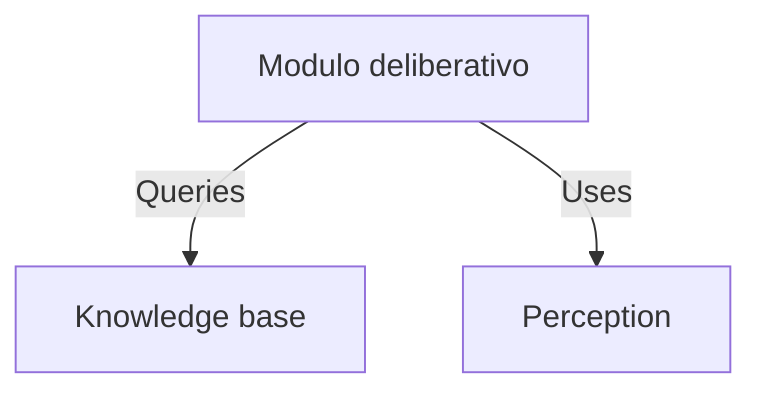
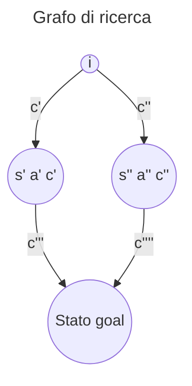
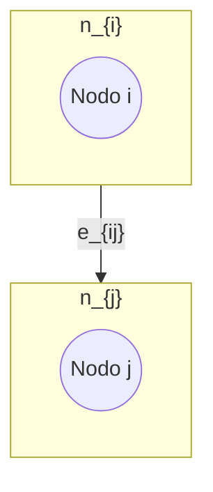
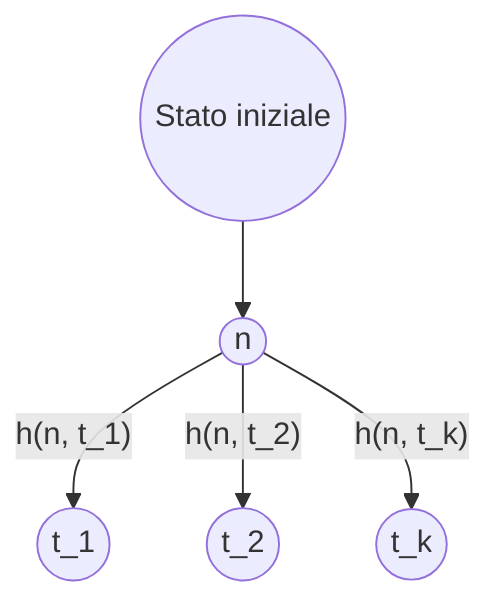

L'intelligenza artificiale deriva dall'unione di due parole:
1. Intelligenza: complesso di facoltà psichiche e mentali che consentono all’uomo di pensare, comprendere o spiegare i fatti o le azioni, elaborare modelli astratti della realtà, intendere e farsi intendere dagli altri, giudicare, e lo rendono insieme capace di adattarsi a situazioni nuove e di modificare la situazione stessa quando questa presenta ostacoli all’adattamento;
2. Artificiale: **ottenuto in maniera non naturale, con procedimenti tecnici**
## Automazione o Intelligenza?
E' bene distinguere la differenza che intercorre tra automazione e intelligenza.
L'automazione deriva dalla scrittura di programmi che **tutto prevedono e tutto gestiscono**: trattano un "ambiente chiuso" nel quale possono capitare solo alcuni eventi, gestibili in maniera totalmente sequenziale. Basti pensare ai [DFA](https://en.wikipedia.org/wiki/Deterministic_finite_automaton).
1. Lavatrice intelligente: non ci verrebbe mai in mente di considerare una lavatrice intelligente realmente tale. Questo perché la lavatrice fa ricadere tutti gli eventi possibili in un particolare caso gestito, come potrebbe essere lo sportello aperto oppure un carico eccessivo.
2. Rover di Marte: ha una capacità aggiuntiva rispetto alla lavatrice, cioè quella di avere un minimo di "**autonomia**". Il segnale tra il Rover e la base terrestre ha una latenza di 20 minuti, non si può pensare ad un semplice radiocomando, il Rover deve essere capace di gestire autonomamente casi come terreno scosceso o presenza di ostacoli nel percorso stabilito.
3. Assistenti virtuali e ChatGPT: sono multipurpose, riescono a gestire eventi in maniera non hardcodata e prevista dal programmatore. Sono scritti in maniera sostanzialmente differente rispetto ai programmi tradizionali.

###### Come stabilire se qualcosa è intelligente?
1. **Test di Turing**: la macchina deve riuscire a produrre gli output attesi.
   Vi è un intervistatore e dall'altra parte una entità sconosciuta (non sa se è umano o una macchina), e l'intervistatore dovrà decretare dopo avergli fatto arbitrarie domande, se quest'ultima sia umano o macchina. Se l'entità sconosciuta è una macchina e l'intervistatore dice "umano", allora la macchina ha superato il test di Turing.
   Il progresso tecnologico ha portato a considerare il test di Turing eccessivamente limitato per poter conferire il titolo di intelligenza ad una macchina in quanto non considera l'**[[Intenzionalità]]**.
2. **[[Intenzionalità#Esperimento della Stanza Cinese |Esperimento della Stanza Cinese]]**: proposto da [John Searle](https://en.wikipedia.org/wiki/John_Searle), aggiunge un livello di complessità aggiuntivo basato sull'[[Intenzionalità]].
   "Il fatto che di fronte agli stessi input un uomo e un computer producano lo stesso output significa che entrambi capiscono cosa stanno facendo"?

Una curiosità è che quotidianamente siamo sottoposti al **Test di Turing inverso** attraverso i **C.A.P.T.C.H.A.** *(Completely Automated Public Turing-test to tell Computers and Humans Apart)*.

## Strong e Weak AI
L'intervento di [John Searle](https://en.wikipedia.org/wiki/John_Searle) ha spaccato la comunità dell'Intelligenza Artificiale in due branchie:
- **Strong AI**: si pone la questione di ottenere la riproducibilità dell'intelligenza umana in quanto tale. Si è sviluppata molto al di fuori del semplice contesto matematico e informatico, andando a coinvolgere discipline quali sociologia, psicologia, ..., andando a configurarsi come una disciplina a parte come **Scienze Cognitive**.
- **Weak AI**: si pone la questione di risolvere problemi che, se risolti dagli esseri umani, richiederebbero intelligenza. E' detta **task-oriented**, e si concentra nello studio del pensiero e del **comportamento razionale** che l'uomo assume di fronte alla soluzione di uno specifico problema.

## Agenti e Ambienti
Gli agenti e gli ambienti sono dei concetti fondamentali per poter studiare approfonditamente la disciplina dell'Intelligenza Artificiale e sono un binomio *<Agente, Ambiente>*.
Perché sono un binomio imprescindibile? Perché un agente può essere particolarmente adatto per un determinato ambiente rispetto ad un altro.
### Agente
Un agente è astrattamente composto da 3 componenti principali:
- **Sensori**: permettono di percepire segnali dall'ambiente in cui si trova. Un esempio software è quello di percepire dati, ambiente in questo caso virtuale.
- **Funzione deliberativa**: sulla base delle informazioni ottenute grazie ai sensori, decide cosa fare.
- **Attuatori**: permettono di agire all'interno dell'ambiente in cui si trova. Un esempio possono essere i freni di un'auto intelligente.
Un agente esegue costantemente un ciclo sequenziale come il seguente:
 1. Percepisco
 2. Delibero
 3. Agisco
### Ambiente
Un ambiente è astrattamente composto da 3 caratteristiche principali:
1. **Osservabilità**:
   - **Completamente osservabile**: i sensori hanno accesso a tutti gli aspetti dell'ambiente per deliberare quale azione eseguire
   - **Parzialmente osservabile**: i sensori danno accesso solo a parte delle informazioni rilevanti per poter deliberare un'azione (imprecisione dei sensori o impossibilità di reperire queste info)
2. **Determinismo**:
   - **Deterministico**: lo stato successivo è determinato dallo stato corrente e dall'azione eseguita, come nei [DFA](https://en.wikipedia.org/wiki/Deterministic_finite_automaton).
   - **Stocastico**: lo stato successivo può differire pur avendo lo stesso stato ed eseguendo la medesima azione. E' detto **strategico** se l'ambiente è stocastico solo sulla base delle azioni eseguite da altri agenti all'interno dell'ambiente.
3. **Staticità**:
   - **Statico**: l'ambiente non cambia mentre l'agente sta deliberando quale azione eseguire
   - **Dinamico**: l'ambiente può cambiare mentre l'agente sta deliberando quale azione eseguire
4. **Numero degli agenti**:
   - **Singolo agente**: viene modellato come singolo agente una sola entità
   - **Multiagente**: vengo modellate entità multiple come agente
 
Un esempio di ambiente sarebbe quello di una strada con attraversamento pedonale.
Un esempio di agente sarebbe un uomo che cerca di attraversare la strada.
L'uomo in questo contesto deve effettuare moltissime valutazioni:
- Identificare il passaggio pedonale
- Rilevare possibili ostacoli
- Rilevare oggetti in movimento
- Rilevare segnali significativi come la luce semaforica
- Costruire un piano di azione, quali attraversare, magari fermarsi un attimo perché una macchina non dà la precedenza
L'ambiente è:
- Complesso (moltissimi altri attori presenti, auto, bici, altri pedoni, ...)
- Parzialmente previdibile (è possibile prevedere la velocità delle macchine, il tempo rimanente della luce verde, ...)
- Parzialmente collaborativo (vige il Codice della Strada, ma non è detto che tutti lo rispettino sempre e questo richiede prudenza aggiuntiva)

## Approccio al Design di Intelligenza Artificiale
L'approccio tradizionale alla programmazione, imperativo e a oggetti, non è adatto alla scrittura di software: è adatto a svolgere un singolo compito e ruota attorno al **come adempierlo in una sequenza di passi**.
```c++
list ins_ord(list L, int dato) {
 if (!L) return(crea_nodo(dato));
 else if (L->d < dato) {
 L->next =
 ins_ord(L->next, dato);
 return L;
 }
 else {
 list tmp = crea_nodo(dato);
 tmp->next = L;
 return(tmp);
 }
}
```

L'approccio adatto all'AI software è quello del **paradigma dichiarativo** e ruota attorno al **cosa so per poter deliberare come agire a riguardo**.
Lo stesso programma quindi è utilizzabile in molteplici situazioni differenti e la percezione è integrata con la base di conoscenze di quest'ultimo.
**E' potente perché l'algoritmo può essere lo stesso, ma la conoscenza può essere totalmente diverso anche in termini di dominio**. (Per esempio, l'algoritmo del [[Mondo Giocattolo]] potrebbe essere tranquillamente utilizzabile anche per decidere la strada per andare da Torino a Catania).


   
Un agente percepisce la situazione iniziale e resta in attesa, non facendo nulla, di ricevere un **goal** (obiettivo) da raggiungere.
Una volta ricevuto il goal, costruisce i passi con i quali andare dalla situazione iniziale a quella desiderata.
Attraverso la **Knowledge Base**, viene a conoscenza delle azioni che può effettuare e di come queste alterino l'ambiente all'interno del quale si trova.
Le azioni sono descritte sulla base di **quando sono applicabili** e **gli effetti sull'ambiente**.

La ricerca del percorso per raggiungere la situazione desiderata richiede la capacità di **ragionamento**, cioè quella di scegliere l'azione utile, tra quelle applicabili, per avvicinarsi all'obiettivo.
**Problema dell'Ottimalità**: noi non vogliamo una soluzione utile, ma la vogliamo in tempi rapidi e che sia efficiente! Questo problema è estremamente non banale.
### Da automazione ad autonomia
- **Automazione**: ormai è standard in molteplici attività, impone che si debba programmare il device a fare ogni passo e gestire ogni caso, ed è applicabile in domini fortemente ripetitivi.
- **Autonomia**: un agente artificiale riceve dei compiti e/o goal ad alto livello, l'utente demanda quindi all'agente la risoluzione.

---
# Risoluzione Automatica dei Problemi
La risoluzione automatica dei problemi coinvolge diverse discipline:
- Ricerca nello spazio degli stati
- Problemi con avversario
- Problemi di soddisfacimento di vincoli
- Inferenza Logica
**La realtà che si vuole trattare con tecniche di risoluzione automatiche di problemi deve poter essere astratta in stati tra i quali transire**.

- **Stato**: condizione corrente
- **Transizione**: passaggio di stato da uno corrente al successivo attraverso un'azione.
  Se esiste uno stato dal quale una stessa azione porta a stati differenti, si parla di *non determinismo*.
- **Obiettivo**: stato che si vuole raggiungere. Ogni stato obiettivo è equivalente a tutti gli altri. Opzionalmente è possibile introdurre anche un valore di prestazione o costo per ottenere una soluzione ottimale.
  L'**Insieme degli Stati Obiettivo** è composto da tutti gli stati che godono della proprietà di essere obiettivo.
- **Percorso**: sequenza di transizione da uno stato iniziale ad uno stato obiettivo.
- **Funzione Costo**: valore associato ad ogni possibile transizione che ci permette di ordinare le soluzioni. E' utilizzata per determinare il percorso minimo, ovvero quello più efficiente tra i possibili percorsi.

E' bene non confondere la soluzione con il goal: se il goal fosse che da Torino si vuole raggiungere una località di mare, Genova fa parte degli stati obiettivo, ma la soluzione non è Genova, bensì il percorso da Torino a Genova.

## Istanza di un problema
Un problema è definito come la seguente n-upla:
$$ <s_i, f_s, t_o, f_c> $$ dove:
- $s_i$ rappresenta lo **stato iniziale**
- $f_s$ rappresenta la **funzione successore** $f_s(s,a) = s'$, dove $s$ stato e $a$ azione.
- $t_o$ rappresenta il **test obiettivo**, funzione che ci informa se uno stato è obiettivo.
- $f_c$ rappresenta la **funzione costo** $f_c(s,a) = c$
Un esempio di problema utile per consolidare il concetto di istanza di un problema è quello del [[Mondo dell'Aspirapolvere]].
Nel corso tratteremo solo ambienti statici e deterministici.

## Algoritmi e Strutture Dati di Ricerca di una Soluzione
Gli algoritmi di ricerca di una soluzione sono suddivisi in due categorie:
- **Algoritmi Blind**: l'unica informazione della quale dispongono è la descrizione del problema, lo stato iniziale.
- **Algoritmi Informati**: hanno una piccolissima conoscenza in più rispetto agli algoritmi blind, ma sono estremamente più performanti e veloci grazie a quest'ultima.
Le **strutture dati per la ricerca** sono:
- **Alberi di ricerca**
- **Grafi di ricerca**
### Albero / Grafo di Ricerca
E' stato utilizzato come mondo di riferimento quello del [[Gioco del 9]].
Data una particolare configurazione della scacchiera di gioco, per esempio quella iniziale del problema, è logico dire quindi che questo sia uno **stato**.
**Uno stato del problema NON corrisponde ad un nodo della struttura di ricerca**.
Uno **stato** mantiene esclusivamente le informazioni relative alla logica di gioco.
Un **nodo** ha più informazioni rispetto ad uno stato:
- Stato al quale si riferisce
- Costo successori
- Riferimento ai "nodi genitori"
- Riferimento ai nodi successivi

![[search-tree.drawio.png]]



Il grafo di ricerca è una struttura più generica, e può dare vita a più sequenze di soluzione per raggiungere un determinato nodo target.
**Soluzione ottima**: sequenza di azioni che portano dallo stato iniziale ad uno stato goal con il costo minimo.
N.B. **Soluzione ottima non significa necessariamente percorso minimo**:
si può avere una soluzione ottima con tanti passi di costo basso rispetto ad una soluzione con pochi passi di costo maggiore complessivamente.

### Definizione di Grafo
$$ G = (\{n_i\}, \{e_{ij}\})$$
dove:
- $n_i$ : nodo generico
- $e_{ij}$ : arco 


Ogni arco $e_{ij}$ ha associato un costo $c_{ij}$.
Inoltre, gli archi sono diretti e quindi l'esistenza di un arco da A verso B non implica che ve ne sia uno da B verso A.
$$ \exists e_{l_m} \in \{e_{ij}\} \neg\Rightarrow \exists e_{ml} \in e_{ij}$$
All'interno di un grafo di ricerca vi sono diversi **stati di nodi**:
- **Nodo creato**: nodo che il nostro algoritmo ha creato in memoria, ma non ha ancora visitato
- **Nodo esplorato**: nodo che il nostro algoritmo ha già valutato

L'insieme dei nodi non esplorati visitabili da quelli che abbiamo esplorato è detto **frontiera**.

## Strategie di ricerca di una soluzione
Le strategie di ricerca sono degli approcci con i quali possiamo andare a ricercare delle soluzioni.
### Schemi di strategia di ricerca
Si parla di schemi di strategia in quanto forniscono delle strategie ad altissimo livello, i quali passi possono essere implementati in maniera estremamente variegata.
- **Ricerca-Albero *(problema)***: ritorna come valore una soluzione, oppure fallimento se non ne esistono.
  ```
  LOOP DO
	  IF (frontiera vuota) THEN RETURN fallimento
	  SCEGLI NODO DALLA FRONTIERA
	  IF (nodo contiene stato obiettivo) THEN RETURN soluzione
	  ESPANDI IL NODO SCELTO
	  AGGIUNGI I NODI SUCCESSORI DI QUELLO SCELTO ALLA FRONTIERA
  ENDLOOP
  ```
  La scelta del nodo scritta in modo così generico ci dà l'idea che possiamo implementare come più ci aggrada questa operazione.

### Confronto di strategie
Questi sono i criteri con i quali le strategie di ricerca di una soluzione vengono valutati.
- **Completezza**: riesce, SEMPRE, a trovare una soluzione qualora ve ne .fossero
- **Ottimalità**: riesce a dare, SEMPRE, una soluzione ottima
- **Complessità spaziale** in termini di memoria
- **Complessità temporale** in termini di tempo di esecuzione

Le strategia di ricerca sono suddivise inoltre in due tipologie:
1.  **Blind**: l'unica informazione è la descrizione del problema $<s_i, f_s, t_o, f_c>$ 
2. **Approcci informati**: utilizzano la descrizione del problema + **ulteriore conoscenza per guidare la ricerca *(euristica)*** e possono essere:
   - **Monoagente**: ad agente singolo
   - **Multiagente** o **con avversario**
   - **CSP**: **C**onstraint **S**atisfaction **P**roblem

La scrittura della strategia di ricerca può essere effettuata tramite la tradizionale programmazione imperativa, in quanto, per esempio, si tratta semplicemente di realizzare un algoritmo che esplora in ampiezza un albero, come vedremo.
La conoscenza rappresenta, nella forma base, la rappresentazione di un problema nella forma $<s_i, f_s, t_o, f_c>$. 
Una volta sviluppata la strategia di ricerca, possiamo riutilizzarla per i più disparati problemi a patto che riusciamo a tradurli in un modello di conoscenza nella forma $<s_i, f_s, t_o, f_c>$ , dove ci si aspetta di trovare una sequenza di passi per raggiungere l'obiettivo.


## Strategie Blind
Le strategie blind principali sono le seguenti:
- **[[Ricerca in ampiezza]]**
- **[[Ricerca a costo uniforme]]**
- **[[Ricerca in profondità]]** *con o senza Backtracking*
- **[[Iterative Deepening]]**
- **[[Ricerca bidirezionale]]**
## Strategie di Ricerca Informate
Sono delle strategie di ricerca che ambiscono ad ottenere **soluzioni ottime in modo efficiente**, e hanno a disposizione la seguente conoscenza:
- **Istanza del problema**: $<s_i, f_s, t_o, f_c>$
- **Euristica**: funzione $h(n, t) = v$, da *heuristics*, dalla quale otteniamo $h(n) = v$, dove
  -  $n$ è un nodo qualsiasi dell'albero/grafo di ricerca
  - $t$ è un nodo target
  - $v$ è una stima del costo per andare da $n\rightarrow t$


$$h(n)=min_i\text{ } h(n,t_i)$$
Sono detti **nodi preferiti di $n$** quei nodi target $t$ per cui il costo stimato è minimo.
Grazie all'*Euristica* avremo quindi una guida per raggiungere in modo efficiente delle soluzioni ottime.

E' detta strategia di ricerca informata una strategia di ricerca che **applica ai nodi della frontiera una funzione di valutazione** $f(n)$. *(La quale può utilizzare internamente anche l'euristica)*

Ne esistono di diverse, noi tratteremo:
- [[Ricerca Greedy]]
- [[A-star]]
- [[RBFS]]
### Funzioni Euristiche
Le funzioni euristiche possono essere:
- [[Euristica Ammissibile|Ammissibili]]: ottimistiche rispetto al costo reale
- **Informative**: per esempio $h(n)=0$ per la definizione di [[Euristica Ammissibile|Ammissibilità]] è ammissibile, ma **NON E' INFORMATIVA**: permetterebbe di valutare solo il costo del percorso fatto per raggiungere il nodo $n$.
- **Consistenti o Monotone**: rispettano la Disuguaglianza Triangolare $\forall n, n', \text{  }h(n)\leq c(n,n',a) + h(n')$


Le funzioni euristiche possono essere più adatte rispetto ad altre in termini di efficienza.

Un esempio potrebbe essere quello del Gioco dell'8.
Proponiamo due euristiche, entrambe [[Euristica Ammissibile|ammissibili]] per risolvere il problema:
- $h_1$: numero di tessere fuori posto rispetto al goal
- $h_2$: distanza di Manhattan, e cioè il numero di spostamenti che la tessera deve fare verticalmente e orizzontalmente per raggiungere la sua posizione desiderata all'interno del goal

e le compariamo in termini di *nodi generati* con l'[[Iterative Deepening]].

| d   | id      | $A* \ h_1$ | $A* \ h_2$ |
| --- | ------- | ---------- | ---------- |
| 2   | 10      | 6          | 6          |
| 4   | 112     | 13         | 12         |
| 6   | 680     | 20         | 18         |
| 8   | ...     | ...        | ...        |
| 10  | ...     | ...        | ...        |
| 12  | 3644025 | 227        | 73         |
| ... | ...     | ...        | ...        |
| 22  | ...     | 18094      | 1219       |
| 24  | ...     | 39135      | 1641       |

E' detta **funzione euristica dominante rispetto ad un'altra** quella *funzione euristica* $h_2$ rispetto ad $h_1$ per cui vale
$$\forall n\ h_1(n)\leq h_2(n)$$
Una funzione dominante è anche detta **più informativa** rispetto ad altre.

Se non si vuole dimostrare in maniera così estensiva, andando a comparare i dati in maniera tabellare tra le funzioni euristiche, è possibile andare a reperire semplicemente la funzione dominante in un insieme di funzioni euristiche in questo modo.

Siano $h_1, h_2,...,h_k$ euristiche ammissibili per un certo problema se:
$$\forall n\ h(n)=\text{MAX}\{h_1(n), h_2(n), ..., h_k(n)\}$$
$h(n)$ è l'**euristica dominante** su $h_1, h_2,...,h_k$

La ricerca di un'euristica valida per un problema può essere ardua, è possibile quindi trovare un'euristica per una **versione rilassata di un problema**: una versione dove i vincoli del problema sono attenuati o rimossi (E.G.: nel gioco dell'8 i movimenti delle tessere sono limitati dallo spazio libero).
Una soluzione ottima di un problema rilassato è ammissibile anche per il problema con i vincoli. 
### Branching Factor effettivo
Supponiamo di avere eseguito A* generando $N$ nodi, e avendo  
Supponiamo di avere eseguito A* su un certo problema, siano:
- $N$: numero di nodi generati a partire da un nodo iniziale
- $d$: profondità della soluzione trovata

$b$* è  il **branching factor di un albero uniforme di profondità d che contiene N+1 nodi**.

E' utilizzato per valutare la bontà di una *funzione euristica*, è un numero reale che più si avvicina a 1, più indica che l'*euristica* è indicata per risolvere il problema.
Avere un branching factor pari a 1 indicherebbe che abbiamo un albero che costituisce un'unica sequenza di passi da effettuare.

# Ricerca con Avversario
La Ricerca con Avversario ci sposta in un **contesto multiagente**: quest'ultimo potrebbe essere *collaborativo*, ma noi studiamo il caso in cui vi sono **2 agenti con obiettivi conflittuali**.
Questi problemi sono talvolta chiamati **giochi**: noi affronteremo il caso di **giochi a turni**.

I giochi a turni sono i più semplici da affrontare in quanto non si deve affrontare un problema dove lo stato dell'ambiente può mutare in tempo reale: è il caso del gioco del Tris.

Le Strategia di Ricerca con Avversario introducono una **Funzione di Utilità**:
**valuta gli stati terminali** di ogni azione mappandolo con un valore talvolta intero che, se positivo rappresenta un "premio", se negativo una situazione di perdita.

Cosa si intende per "stati terminali"?
Il contesto multiagente impone che, per esempio nel tris, dopo la nostra azione, lo stato successivo non sarà più determinato da noi, ma bensì dall'agente avversario: sarà quindi necessario per le Strategia di Ricerca con Avversario andare a valutare tutti i possibili stati che potrebbe causare l'avversario dopo una scelta.

## Giochi
I giochi sono quindi **contesti multiagente** dove gli agenti hanno goal conflittuali.
Sono classificabili secondo le seguenti proprietà:
- **A informazione perfetta / imperfetta**: caratteristica per la quale gli agenti sono in possesso di tutte le informazioni utili a poter effettuare una decisione all'interno dell'ambiente
- **Effetti della scelta deterministici / stocastici**: caratteristica per la quale la scelta intrapresa da un agente porta ad un solo stato oppure può portare a diversi stati

|  | Informazione Perfetta | Informazione Imperfetta |
|---|---|---|
| **Deterministico** | Scacchi | Master Mind |
| **Stocastico** | Monopoli | Poker |


### Teoria delle Decisione nell'ambito dei Giochi a Somma Zero
**Giochi a Somma Zero**: sono giochi dove il guadagno di un agente è compensato dalla perdita di altri.
E.G.: se c'è una torta e due agenti, se uno dei due mangia metà torta, questo avrà guadagnato quella metà, e il suo guadagno è compensato dalla perdita di metà torta dell'avversario.

La teoria della decisione studia **gli approcci alla decisione**:
- **Appoccio Maximax**: è un approccio **ottimistico**, sceglie sempre il **massimo guadagno** per scelta possibile
- **Approccio Minimax**: è un approccio **pessimistico**, sceglie sempre la **minima perdita** per scelta possibile
- **Minimax Regret**: è un approccio di **pentimento minimo**, calcola il **Best Regret**:
  $$\text{Best Regret}= \text{Best Payoff} - \text{Real Payoff}$$
  e computa una **tabella dei pentimenti**.
  Una volta computata, sceglie il **pentimento massimo minimo**.
  Massimo rispetto ai pentimenti possibili dopo le azioni degli altri agenti data un'azione, minimo rispetto agli altri pentimenti massimi derivanti dalle altre azioni.
  
Durante la trattazione della teoria delle decisioni nell'ambito dei Giochi a Somma Zero, ci utilizzeremo i seguenti termini per indicare con:
- **MAX**: il giocatore che vogliamo aiutare a scegliere la mossa
- **MIN**: il giocatore contro il quale gioca MAX, lo consideriamo un **avversario perfetto** durante la valutazione delle decisioni, e cioè per ogni suo nodo scegliamo come suo successore quello che mette *MAX* nella situazione peggiore
- **Nodo terminale**: nodo in cui è possibile calcolare una **funzione di utilità per MAX**.

**Funzione di utilità**: è una funzione applicabile solo ed esclusivamente ai nodi terminali, e deve esplicitare valori che rendano l'idea della condizione di vittoria rispetto a quella di sconfitta.
Un esempio può essere il seguente:

$$f_\text{utilità}(n_\text{terminale})= \begin{cases} 1 & \text{se rappresenta una vittoria di MAX } \\ 0 & \text{se rappresenta un pareggio} \\ -1 & \text{se rappresenta una sconfitta per MAX} \end{cases} $$
Gli algoritmi di Ricerca con Avversario sono strani perché **non ci danno una soluzione**, ma bensì **solo la mossa successiva da fare**.
Perché? Perché non possono sapere la mossa che farà l'avversario, non è detto che faccia la mossa che peggiora più di tutte la condizione di vittoria di MAX.

Se per i *nodi terminali* utilizziamo la *funzione di utilità* per capire quale siano i nodi terminali da prediligere, d'altro canto ci è necessario poter valutare i nodi intermedi di MAX e MIN.
Viene introdotta infatti una **funzione di valutazione dei nodi intermedi**:
$$\text{valore-minimax}(n)= \begin{cases} f_\text{utilità}(n) & \text{se } n \text{ è terminale} \\ \text{MAX}_{S\in\text{SUCC}(n)}(\text{valore-minimax}(S))  & \text{se è un nodo di MAX} \\ \text{MIN}_{S\in\text{SUCC}(n)}(\text{valore-minimax}(S))  & \text{se è un nodo di MIN} \end{cases} $$
E' facile notare che la considerazione di *MIN* come *avversario perfetto* è ben esplicitata in quanto, nel caso di un nodo di *MIN*, viene considerato come valore il minimo tra i valori della *funzione di utilità* per *MAX*.

Grazie alla funzione di utilità è possibile introdurre l'**Algoritmo Minimax**.

## Algoritmo Minimax
L'algoritmo Minimax è un algoritmo di ricerca con avversario che visita l'albero delle possibilità in profondità, da qui deriva l'estrema efficienza in termini di spazio.
E' facilmente implementabile grazie delle seguenti funzioni
```
function MINIMAX-DECISION(state) returns ACTION {
	v <- MAX_VALUE(state)
	return ACTION IN SUCCESSORS(state) WITH value v
}

function MAX_VALUE(state) returns UTILITY_VALUE {
	if(isTerminalState(state)) => return UTILITY_VALUE(state)
	v <- -∞
	for(a,s) IN SUCCESSORS(state)
		v <- MAX(v, MIN_VALUE(state))
	return v
}

function MIN_VALUE(state) returns UTILITY_VALUE {
	if(isTerminalState(state)) => return UTILITY_VALUE(state)
	v <- +∞
	for(a,s) IN SUCCESSORS(state)
		v <- MIN(v, MAX_VALUE(state))
	return v
}
//mappata in modo adatto al gioco di riferimento
function UTILITY_VALUE(state)
```

### Valutazione delle complessità di Minimax

- **Complessità temporale**: $O(b^m)$, perché **costruisce per intero l'albero** dove
  - $b$: branching factor *medio*
  - $m$: profondità massima dell'albero
- **Complessità spaziale**: 
  - $O(b*m)$ se *senza backtracking*
  - $O(m)$, se *con backtracking*

La complessità temporale ci impone di andare a cercare un'ottimizzazione dell'algoritmo.

## Algoritmo Minimax con Potatura Alfa-Beta
Osserviamo che durante la visita dell'albero **non vogliamo osservare tutti i percorsi di gioco**, ma bensì solo quelli **migliori nel caso sia una scelta di *MAX***, e quelli **peggiori nel caso sia una scelta di *MIN***.
Per raggiungere tale comportamento viene introdotto un **intervallo alfa-beta**:
$$\alpha|--------\text{ }|\beta$$
dove:
- $\alpha$: **minimo guadagno di *MAX***, detto anche **massimo lower bound**, è il valore che *MAX* ha tutto l'interesse di aumentare
- $\beta$: **massimo guadagno di *MIN***, detto anche **minimo upper bound**, è il valore che *MIN* ha tutto l'interesse di diminuire

Le firme dell' [[#Algoritmo Minimax]] diventano quindi le seguenti:
```
function ALPHA-BETA-DECISION(state, alpha, beta) returns ACTION {
	v <- MAX_VALUE(state)
	return ACTION IN SUCCESSORS(state) WITH value v
}

function MAX_VALUE(state, alpha, beta) returns UTILITY_VALUE {
	if(isTerminalState(state)) => return UTILITY_VALUE(state)
	v <- -∞
	for(a,s) IN SUCCESSORS(state)
		v <- MAX(v, MIN_VALUE(state, alpha, beta))
		if(v >= beta) => return v
		alpha = MAX(alpha, v)
	return v
}

function MIN_VALUE(state, alpha, beta) returns UTILITY_VALUE {
	if(isTerminalState(state)) => return UTILITY_VALUE(state)
	v <- +∞
	for(a,s) IN SUCCESSORS(state)
		v <- MIN(v, MAX_VALUE(state, alpha, beta))
		if(v <= alpha) => return v
		beta = MIN(beta, v)
	return v
}
//mappata in modo adatto al gioco di riferimento
function UTILITY_VALUE(state)
```
E' bene comprendere che quindi si aggiungo 2 ulteriori funzioni ai cicli di scorrimento dei successori:
- **Controllo del range**: se $v$ risulta rispettivamente *maggiore o uguale* oppure *minore o uguale* del limite opposto, allora abbiamo trovato una ramificazione che **non vale la pena esplorare**
- **Aggiustamento del range**: se $v$ risulta rispettivamente *maggiore* oppure *minore* rispetto al limite analogo, lo aggiorniamo

### Valutazione delle complessità di Minimax con Potatura Alfa-Beta
- **Complessità temporale**: 
  - $O(b^{3/4m})$ nel **caso peggiore**
  - $O(b^{m/2})$ nel **caso medio**, grazie alle *Killer Moves*
- **Complessità spaziale**: 
  - $O(b*m)$ se *senza backtracking*
  - $O(m)$, se *con backtracking*

Le *Killer Moves* sono mosse precedentemente identificate come forti e che hanno portato a una potatura efficace durante la ricerca in alberi di gioco.

**Nonostante il miglioramento della complessità spaziale**,  *soprattutto nel caso medio*, anche questo algoritmo **non è sufficientemente veloce per i** **Giochi in Tempo Reale**.

## Giochi in Tempo Reale
I Giochi in Tempo Reale sono dei giochi che necessitano di rispondere con un'azione con un vincolo di tempo.
Un modo per poterli affrontare con le strutture che abbiamo visto per quanto riguarda la [[#Ricerca con Avversario]] è quello di andare ad implementare un limite di tempo oltre il quale la Strategia di Ricerca non potrà più continuare ad esplorare l'albero di gioco.
Questo introduce il problema di dover **valutare l'utilità dei nodi intermedi**, i quali, non essendo *nodi terminali*, non possono essere utilizzati con la *funzione di utilità* che abbiamo specificato.

### Strategia 1 - Tecniche di Apprendimento Automatico per Sintetizzare la Funzione di Utilità
Questa strategia consiste nell'utilizzare una base di dati relativi agli Stati di Gioco, i quali verranno passati ad una **funzione costruita di approssimazione dell'obiettivo** che risponderà con l'**esito più probabile**.
Etichettare singolarmente ogni possibile Stato di Gioco risulta essere estremamente oneroso e pesante, e non sempre è fattibile farlo: potrebbe risultare complicato dato uno stato $S$ andare a determinare, per esempio, se questo porti con più probabilità alla vittoria, alla sconfitta o un pareggio.
### Strategia 2 - Valutazione delle caratteristiche rilevanti
Questa strategia **cerca di risolvere la difficoltà di etichettare tutti gli stati dei casi d'interesse reali**.
Solitamente ci si riferisce ad un esperto del settore che vogliamo trattare, e si passa poi ad:
- **Identificare le** **caratteristiche misurabili e rilevanti degli stati**, $f_i$
- **Attribuire un peso a ciascuna caratteristica**, $w_i$
- **Calcolare la combinazione lineare sullo stato con**
  $$\text{EVAL}(S)=\sum_{i=1}^{n} w_i \cdot f_i
$$
dove $n$ è il numero delle caratteristiche misurabili rilevate.

### Problema dell'Orizzonte e Quiescenza
L'introduzione di una funzione di valutazione dell'utilità di nodi intermedi che risponde sulla base delle probabilità comporta il Problema dell'Orizzonte.
Per comprenderlo, è necessario introdurre il concetto di quiescenza:

Uno stato $S$ è detto:
- **Stato Quiescente**: se è uno stato tranquillo, e cioè che se ha come probabilità maggiore quella di un esito $x$, questa non verrà stravolta nelle primissime mosse successive
- **Stato NON-Quiescente**: è uno stato instabile, potrebbe totalmente stravolgere le probabilità nelle mosse successive

**La *Quiescenza* quindi può portare ad intraprendere percorsi subottimali o del tutto inutili per gli scopi dell'agente**.

Il **Problema dell'Orizzonte** deriva dal fatto che **il limite di tempo potrebbe portare a valutare uno stato non quiescente**, e come diretta conseguenza **l'agente potrebbe ignorare completamente alcune possibili conseguenze sul lungo termine**.

Una soluzione potrebbe essere quella di tenere in conto della quiescenza all'interno della funzione di valutazione, andando a prediligere quindi gli stati quiescenti rispetto a quelli che non sono tali.

### Tabelle di Trasposizione
Una **trasposizione** è una **sequenza di mosse** che portano da uno stato $S$ ad uno stato $S'$.

Le tabelle di trasposizione solo delle tabelle che registrano le **trasposizioni che portano da uno stato $S$ ad $S'$**.
Data una sequenza di mosse $S \rightarrow (A,B,C) \rightarrow S'$ e $S \rightarrow (B,C,A) \rightarrow S'$, le tabelle di trasposizione permettono di registrare che $(A,B,C)$ e $(B,C,A)$, seppur ordinamenti differenti, portano allo stesso stato finale.

Sono estremamente utili per andare a rendere più efficienti gli algoritmi di ricerca, permettendo loro di non andare a valutare percorsi differenti che portano comunque allo stesso nodo.

# CSP - Problemi di Soddisfacimento di Vincoli
I CSP (Constraint Satisfaction Problems) sono dei **problemi di ricerca in uno spazio degli stati**.

Un CSP è composto da:
1. **Insieme di Variabili**
2. **Insieme di Vincoli**
3. **Domini delle variabili**

o alternativamente da:
 1. **Insieme di Variabili con il loro dominio**
 2. **Insieme di Vincoli**

I CSP sono problemi che consistono nel trovare un **assegnamento** di tutte le variabili che soddisfa i vincoli.

Un **assegnamento** è un insieme di coppie che consiste in un'associazione di valori alle variabili del problema $$\{x_1=v_1, x_2=v_2, ..., x_n=v_n\}$$
con valori ovviamente compatibili con il dominio di quest'ultime.

Dato un insieme di variabili $\{x_1, x_2, x_3\}$, **un assegnamento è detto** :
- **Assegnamento Vuoto**: $\{\ \}$, se non assegna alcun valore ad alcuna variabile
- **Assegnamento Completo**: $\{x_1=v_1,x_2=v_2,x_3=v_3\}$, se assegna un valore ad ogni variabile
- **Assegnamento Consistente**: $\{x_1=v_i, x_3=v_k\}$, se assegna dei valori che soddisfano tutti i vincoli
- **Soluzione**: se è *Completo* e *Consistente*
 
**N.B.** $Consistente \nRightarrow Completo \land Completo \nRightarrow Consistente$

##### Commutatività dei CSP
Per gli assegnamenti vale la proprietà della **Commutatività**: l'ordine degli assegnamenti dei valori alle variabili porta ad avere lo stesso assegnamento. 
$$\{x_1=v_1,x_2=v_2\} = \{x_2=v_2,x_1=v_1\}$$

I CSP sono problemi onnipresenti nella vita di tutti i giorni, e vedono casi d'uso in:
- Progettazione di Turni di Lavoro, *per esempio nelle Linee Aeree o anche i semplici orari scolastici*
- Logistica, *per i vincoli di tempo di consegna e per massimizzare lo spazio nei mezzi di trasporto*
- Produzione, *per minimizzare il consumo di materie prime nel taglio di stoffa o [pannelli di acciaio nelle segnaletiche stradali](https://youtu.be/_Gu1_S1SIeg?t=685)*

## CSP come Problema di Ricerca in uno Spazio di Stati
Sebbene possa sembrare controintuitivo andare a considerare un CSP come un Problema di Ricerca in uno Spazio di Stati, è in realtà molto semplice considerare un CSP come un'istanza di un problema $P$
$$ P\ =\ <s_i, f_s, t_o, f_c> $$
dove:
- $s_i$: è sempre l'*Assegnamento Vuoto*
- $f_s$: assegnamento di un valore ad una variabile senza valore
- $t_o$: test di *Completezza* e *Consistenza*
- $f_c$: inutilizzata, gli assegnamenti di valore hanno costo costante, solitamente si dice $f_c=1$

Si può notare sin da subito come i CSP abbiamo una **forma fortemente standardizzata**.

La **profondità massima $m$** è equivalente alla **cardinalità dell'*Insieme di Variabili***.
L'**ordine degli assegnamenti** è **ininfluente**.

Un esempio di problema introduttivo ai CSP visti come Problema di Ricerca in uno Spazio di Stati è il **[[Problema dell'Australia]]**.
### Domini delle Variabili nei CSP
Si parte dal caso più semplice dove il dominio delle variabili è quello *Booleano*, fino al dominio di *Valori Continui*.
- **Dominio Booleano**: due valori, $\text{True False}$ o $0\ 1$
- **Valori Discreti con Dominio Finito**: *Enumerazioni di Costanti*, $\text{etc...}$
- **Valori Discreti con Dominio Infinito**: per esempio $\forall x \in \mathbb{Z}$
- **Valori Continui**: $\forall x \in \mathbb{R}$

N.B. A partire dal dominio Booleano a quello dei valori Continui, notiamo che intercorre una relazione a catena per il quale un è sottoinsieme dell'altro.

E' bene identificare il dominio del CSP che si sta affrontando perché **ogni dominio ha un linguaggio di specifica differente**!
*E.G.: nel dominio dei Valori Discreti con Dominio Infinito, potremmo mappare i giorni con i numeri interi e dire che un'attività $\text{Task}_2$ debba essere eseguita quantomeno 5 giorni dopo $\text{Task}_1$ con il seguente vincolo: $\text{Task}_1 + 5 < \text{Task}_2$ .*

### Vincoli e Criteri di Preferenza
I vincoli sono classificati in base al numero di variabili che vengono coinvolte:
1. **Unari**: $\text{Età}\geq18$
2. **Binari**: $WA\neq NT$
3. **Con 3 o più variabili**: *per esempio nella Cripto-Aritmetica* 

Tratteremo all'interno del corso solo vincoli *Unari* e *Binari*, in quanto è possibile dimostrare come vincoli di 3 o più variabili possano essere ricondotti ad una serie di vincoli binari e unari.

E' bene distinguere i *Vincoli* dai *Criteri di Preferenza*:
- **Vincoli**: **condizione obbligatoria**, la *Soluzione* deve assolutamente rispettarla
- **Criteri di Preferenza**: **condizione morbida**, utile per il ranking di soluzioni, ma può essere violato dall'algoritmo di ricerca

## Strategie di Ricerca per CSP
Tratteremo le differenti Strategie di Ricerca prendendo in esame la loro applicazione sul [[Problema delle 8 Regine]].

Le strategie di Ricerca per CSP sono:
- **[[Generate & Test]]**
- **[[Backtracking Search per CSP]]**
- **[[Backtracking Search per CSP con Inferenza]]**
- **[[Backjumping Search]]**

### Euristiche per CSP
Le Euristiche per CSP **forniscono degli approcci all'assegnamento** dei valori alle variabili che puntano a renderli più **efficiente**.
N.B. Non sono le stesse euristiche delle [[#Strategie di Ricerca Informate]].

Le euristiche, in ordine di applicazione, sono:
- **Minimum Remaining Values (Fail First)**: seleziona la variabile con il minor numero di valori alternativi consistenti con le scelte fatte. [[Esempio Minimum Remaining Values - Fail First|Esempio]].
- **Euristica di Grado**: seleziona la variabile coinvolta in più vincoli quando vi sono dei pari merito.
  L'idea risiede nel fatto che la variabile coinvolta in più vincoli sarà sicuramente la più problematica. [[Esempio Euristica di Grado per CSP|Esempio]].
- **Euristica del Valore meno Vincolante**: sceglie il valore che lascia più liberta alle variabili adiacenti rispetto al [[Grafo dei Vincoli]].
  L'idea risiede nel fatto che scegliere un valore più vincolante per le altre variabili rischia di tagliare via le soluzioni.
  Nell'esempio di vuole effettuare un assegnamento di valore alla variabile $Q$ che ha come possibili valori consistenti con i vincoli del CSP $\{R, B\}$. [[Esempio Euristica valore meno vincolante|Esempio]].

### Modalità di Inferenza
L'inferenza ha lo scopo di ridurre lo spazio di ricerca in modo consistente usando i vincoli per tagliare assegnamenti non consistenti con l’informazione disponibile.

Esistono diverse modalità di inferenza, noi ne vedremo 4, dalla più semplice alla più complicata in termini di implementazione.
1. **[[Forward Checking]]** (più un approccio che modalità)
2. **[[Node Consistency]]**, anche detta 1-consistency
3. **[[Arc Consistency]]**, anche detta 2-consistency
4. **[[Path Consistency]]**, anche detta 3-consistency

In generale, si parla di **K-Consistency**:
> Se per ogni sottoinsieme di ($k-1$) variabili e per ogni loro assegnamento consistente, è possibile identificare un assegnamento per la $k$-esima che è consistente con tutti gli altri, il CSP è detto **Fortemente Consistente**.
> Un **CSP Fortemente Consistente è risolvibile in tempo lineare** $O(n\ d)$ dove $n$ è il numero delle variabili e $d$ il numero dei valori.

### Vincoli Speciali
I Vincoli Speciali fanno fortemente uso del [[Conflict Set]].
![[Conflict Set]]

I Vincoli Speciali sono:
- **ALL DIFFERENT**: se ho $n$ variabili e $m$ valori con $m < n$, ed valori delle variabili elencate devono essere tutti differenti, il problema non è risolvibile e non vale la pena spendere tempo a risolverlo.
- **AT MOST**: : le attività $A_1, …, A_k$ possono impegnare complessivamente al più $N$ risorse

# Rappresentazione della Conoscenza e Ragionamento Automatico
Questa branchia deriva dall'Inglese **KRR**: Knowledge Rappresentation Reasoning.

I dati sono classificabili nel seguente modo:
- **Dati**: dati nudi e crudi, come quelli recepiti dai nostri sensi
- **Informazione**: il fatto che un simbolo che abbiamo recepito con la vista sia una lettera
- **Conoscenza**: il fatto che sia una lettera ci permettere di supporre che appartenga ad un alfabeto.

Fare **Ragionamento Automatico** significa partire da una **Base di Conoscenza di Partenza** e degli **Elementi Percettivi**, e attraverso dei processi di trasformazione produrre "nuova conoscenza".
In realtà, più che "nuova conoscenza" nel vero senso della parola, **permette di rendere esplicita la conoscenza implicita che la base di conoscenza di partenza dà**.

Un esempio di ragionamento automatico potrebbe essere il seguente:
- Tutte i cetacei vivono in mare
- Tutte le balene sono cetacei
- *Allora,* tutte le balene vivono in mare

Da questo esempio possiamo ottenere uno **schema di conoscenza**:
- Tutti gli A hanno P
- Tutti gli B sono A
- *Allora,* tutti gli B hanno P

Questo è un esempio di ragionamento logico detto [Sillogismo](https://it.wikipedia.org/wiki/Sillogismo).
Questo tipo di ragionamento ha delle regole rigide, e se ha delle regole rigide, allora è automatizzabile e questo per noi diventa molto interessante.

Al fine di poter rappresentare la conoscenza necessito di
1. Linguaggio particolare per rappresentare la conoscenza
2. Regole o Schemi per esplicitare nuova conoscenza precedentemente implicita
3. Algoritmi, *per automatizzare il processo di esplicitare in grado di poter applicare queste regole*

Al fine di poter immagazzinare delle informazioni, dobbiamo trovare una forma per mantenerle in memoria all'interno della **Knowledge Base** (Base di Conoscenza) **in forma dichiarativa**.

## Knowledge Base

La Knowledge Base è la base di conoscenza di un agente che lo informa del mondo circostante.
Data una base di conoscenza $KB_0$, ogni qualvolta un agente effettua della **percezione del mondo circostante**, migliora la propria conoscenza.
La Knowledge Base è una rappresentazione astratta della realtà, non coincide con essa, ma è strutturata in modo tale da tener conto delle informazioni utili per l'agente.

$$\forall i\ \text{KB}_i + \text{PERC}_i + \text{AZIONE}_i = \text{KB}_{i+1}$$
Le operazioni fondamentali che un agente può effettuare con la propria Knowledge Base sono:
- $\text{TELL}(\text{KB}_i, \text{PERC}_i)\rightarrow \text{KB}_{i+1}$: informa la Knowledge Base all'istante $i$ delle informazioni ottenute attraverso la percezione, andando ad ottenere una Knowledge Base aggiornata e magari con più informazioni
- $\text{ASK}(\text{KB}_i, \text{QUERY})$: chiede alla Knowledge Base all'istante $i$ all'azione da effettuare

Consapevoli del fatto che la Knowledge Base sia un'astrazione della realtà, vogliamo comunque che la manipolazione (**inferenza**) di quest'ultima, magari per ottenere nuova conoscenza, sia una **manipolazione della conoscenza corretta**: qualunque conclusione tratta dall'agente deve avere un corrispettivo nella realtà effettiva.

Prendendo in esame la formula $x+y=4$, questa è una *Rappresentazione Astratta*: di per sé non è né vera, né falsa. Per essere valutata con *Vero o Falso* deve essere "ancorata al mondo": assegniamo per esempio dei valori che ci permettano di rispondere con *Vero o Falso*.

> **Modello**: attribuzione di valori che definisce il valore di verità di una formula.
> In generale vale la definizione sopracitata, ma alcune volte useremo la seguente.
> Un modello $m$ è detto *modello della formula $F \iff$* rende $F$ vera.  

### Relazione tra le formule

>Date due formule $F_1$ e $F_2$, si dice che $F_1$ è **conseguenza logica di** $F_2$ se ogni modello $m$ di $F_1$ è anche un modello di $F_2$.
$$F_1 \vDash F_2$$
>La **Conseguenza Logica** è detta **Relazione Semantica**: ovvero una relazione che intercorre tra insiemi dei modelli delle formule.


>Date due formule $F_1$ e $F_2$, queste sono dette **equivalenti** con
$$F_1\equiv F_2$$  se $F_1\vDash F_2 \land F_2 \vDash F_1$, e cioè se l'insieme dei modelli di $F_1$ coincide con quello di $F_2$.

>Data una formula $P$ questa è detta **valida** se è vera per ogni modello. (**Tautologia**)

> Data una formula $P$ questa è detta **contraddizione** se è non è vera in nessun modello. (**Formula Insoddisfacibile**)

> Data una formula $P$ questa è detta **soddisfacibile** se $\exists m$ modello di $P$

### Model Checking
Il Model Checking è un modo algoritmico per determinare se una formula $F_1$ sia una conseguenza logica di $F_2$.
1. Enumera tutti gli i modelli di $F_1$
2. Verifica che questi siano tutti modelli di $F_2$
3. Se sì, la conseguenza logica è verificata, altrimenti non ve n'è.

Il Model Checking ha un problema che consiste nel dover generare tutti i modelli di $F_1$, quindi, supponendo di avere:
- $d$, numero dei valori possibili delle variabili
- $n$, numero delle variabili della formula

incappa nel dover generare $d^n$ modelli, quindi ha una complessità esponenziale.

### Sillogismi: Modus Ponens
Il Modus Ponens è un particolare sillogismo dove, date $\alpha,\beta$ formule:
- $\alpha \Rightarrow \beta$, *per esempio "Tutti gli uomini sono mortali"*
- $\alpha$, *per esempio "Socrate è un uomo"*
possiamo trarre una conclusione
- $\beta$, *per esempio "Socrate è mortale"*

Abbiamo quindi applicato una **Regola di Inferenza**.

### Correttezza di un Algoritmo di Inferenza
Un algoritmo di inferenza è corretto solo quando deriva formule che sono conseguenze logiche delle premesse.
$$\forall \text{KB} \text{ se } \text{KB}\vdash A, \text{ allora } \text{KB}\vDash A$$
e cioè, se da $\text{KB}$ è possibile inferire $A$, allora $A$ è conseguenza logica di $\text{KB}$.

### Completezza di un Algoritmo di Inferenza
E' più complicata da dimostrare, e non lo si può fare sempre.
$$\forall \text{KB} \text{ se } \text{KB}\vDash A, \text{ allora } \text{KB}\vdash A$$
e cioè, se $A$ è conseguenza logica di $\text{KB}$, allora è possibile inferire $A$ da $\text{KB}$.

## Logica Proposizionale
La Logica Proposizionale è un **linguaggio attraverso il quale è possibile rappresentare conoscenza**.
Questo linguaggio ha una grammatica ben precisa.
- **Formula**:
  - **Atomica**: $\text{TRUE}|\text{FALSE}|$Simbolo
  - **Complessa**: (in ordine di importanza)
    1.  $\lnot \text{FORMULA}$
    2. $\text{FORMULA}\land \text{FORMULA}$
    3. $\text{FORMULA}\lor \text{FORMULA}$
    4. $\text{FORMULA} \Rightarrow \text{FORMULA}$
    5. $\text{FORMULA}\iff \text{FORMULA}$
- **Simboli**: etichette che mappiamo ad una formula

Ai fini di introdurre alla logica proposizionale, utilizzeremo questa base di conoscenza di partenza:
- $R1)\ \text{PIOVE}\Rightarrow \text{ATMOSFERA-UMIDA}$
- $R2)\ \text{NOTTE} \lor \lnot \text{VENTO} \Rightarrow \text{ATMOSFERA-UMIDA}$
- $R3)\ \text{ATMOSFERA-UMIDA}\Rightarrow (\text{PRATO-BAGNATO}\land \text{STRADA-BAGNATA})$
- $R4)\ \text{INNAFFIATORE-ON}\Rightarrow \text{PRATO-BAGNATO}$
- $R5)\ \text{PIOVE}\Rightarrow \text{OMBRELLO-APERTO}$
- $R6)\ \text{SOLE}\land \text{VENTO}\Rightarrow \text{INNAFFIATORE-ON}$
- $R7)\ \text{SOLE}\land \text{VENTO}\Rightarrow \text{ATMOSFERA-ASCIUTTA}$
- $R8)\ \text{SOLE}\Rightarrow \lnot \text{NOTTE}$
- $R9)\ \text{NOTTE}\Rightarrow \lnot \text{SOLE}$
- $R10)\ \text{ATMOSFERA-ASCIUTTA}\Rightarrow \lnot \text{ATMOSFERA-UMIDA}$

L'implicazione è un caso particolare, infatti è utilizzata diversamente in base al ragionamento che viene fatto:
- $Fido\ è\ un\ cane \Rightarrow Fido\ è\ un\ mammifero$, configura un **ragionamento ontologico**
- $Marco\ ha\ vinto\ il\ match \Rightarrow Marco\ ha\ giocato\ il\ match$, configura un **ragionamento temporale**
- $John\ è\ stato\ condannato\ per\ furto \Rightarrow Il\ furto\ è\ un\ crimine$, configura un **ragionamento causale**

### Theorem Proving
Il Thereom Proving pone le sue basi su due elementi:
- **[[Teorema di Deduzione]]**
- **Dimostrazione per Refutazione**: approccio dove, per dimostrare che $A\vDash B$, si utilizza la [[Regola di Risoluzione]] con $A \land \lnot B$

E' decisamente più efficiente del [[#Model Checking]] in quanto fa un forte utilizzo delle [[Regola di Inferenza|Regole di Inferenza]] anziché generare l'intera enumerazione di modelli possibili.


## Algoritmo di Inferenza
Un algoritmo di inferenza è un algoritmo ottenuto dall'unione di
- [[Regola di Inferenza|Regole di Inferenza]]
- **Algoritmo di Ricerca**, *solitamente la [[Ricerca in ampiezza]]*

Un algoritmo di inferenza risolve problemi nello spazio degli stati nella seguente forma:
- $s_i$: ${KB}$, *knowledge base iniziale o background knowledge*
- $f_s$: utilizzo di una [[Regola di Inferenza]]
- $t_o$: risolvente equivale alla clausola vuota $\square$
- $f_c$: inutilizzata

### CP-Risoluzione
Un esempio di algoritmo di inferenza è quello di CP-Risoluzione (CP da Calcolo Proposizionale).
```
CP-Risoluzione(KB, A) RETURNS true/false alla domanda (A è conseguenza logica di KB?)
clausole <- {KB in CNP e not A}
new <- { }
LOOP DO {
	FOREACH Ci,Cj in clausole{
		risolvente <- IR-Risoluzione(Ci, Cj)
		if(risolvente is [] clausola vuota)
			return true
		new <- new U risolvente
	}
	if (new incluso in clausole) //se non ho prodotto nulla di nuovo
		return false
	clausole <- clausole U risolvente
}
```

## Clausole di Horn
Le Clausole di Horn sono delle clausole di forma ristretta rispetto alle clausole normali (per intenderci le disgiunzioni di letterali).

Un clausola è detta **Clausola di Horn** se:
- E' una disgiunzione di letterali, *per esempio* $\lnot A \lor B \lor C \lor \lnot D$
- Ha **un solo letterale positivo**, **tutti gli altri devo essere preceduti da una negazione**

E' detta **Clausola Definita** una clausola di Horn nella forma $$ \lnot A\lor \lnot B \lor \lnot C \lor D$$
E' detta **Fatto** una clausola di Horn composta da un solo letterale positivo $$D$$
Possiamo notare come attraverso una serie di equivalenze è possibile ricondurre una clausola definita ad una implicazione della forma
$$ \lnot A\lor \lnot B \lor \lnot C \lor D \equiv \lnot(A\land B\land C)\lor D\equiv A \land B\land C \Rightarrow D$$

Questa implicazione $A\land B\land C \Rightarrow D$ è alla base della **Programmazione Logica** e sono particolari clausole sulle quali è possibile applicare dei **meccanismi di ragionamento con complessità lineare** in funzione del numero di clausole.

## Forward Chaining
E' una tecnica di ragionamento **guidata dai dati** che utilizza il [[#Sillogismi Modus Ponens|Modus Ponens]] come unica [[Regola di Inferenza]] utilizzata che permettono di **dimostrare formule atomiche**.

Dati due fatti, $A,B$, e la seguente base di conoscenza
![[Esempio di Clausole di Horn]]
otterremo un **Albero And-Or** come il seguente, per dimostrare $KB \land Q$. [[albero-and-or-forward-chaining.png|Esempio]].

La complessità temporale è $O(n)$.

## Backward Chaining
E' una tecnica di ragionamento analoga al Forward Chaining che **applica il Modus Ponens al contrario**.
E' facilmente implementabile attraverso uno **Stack (LIFO)** .

Supponiamo di voler dimostrare $G_2$: il backward chaining va a cercare una clausola che implichi $G_2$.
Per esempio: $A \land G_1 \Rightarrow G_2$.
Il backward chaining procede quindi a verificare se $A$ e $G_1$ siano vere.
Se per esempio $A$ è un dato, quindi è da assumere per vero, allora il suo goal per dimostrare che $G_2$ sia vero è quello di dimostrare $G_1$.

Mediamente è più efficiente del [[#Forward Chaining]] in quanto va ad attivare meno clausole, è infatti detto **mediamente meno che lineare**.

# Logica del Prim'Ordine (FOL)
La Logica del Primo Ordine, o **First Order Logic** è **linguaggio in grado di rappresentare della conoscenza** che cerca di andare a risolvere due problemi della [[#Logica Proposizionale]]:
- Bassa espressività
- Impossibilità di rappresentare in modo compatto

Permette di ragionare su **oggetti e relazioni** ed ha elementi sintattici più variegati quali:
- **Simboli di Costante**: *per esempio,  John, Richard, ... , in riferimento a oggetti*
- **Simboli di Predicato**: relazioni che rispondono con vero o falso, *per esempio Fratello(John, Richard)*
- **Simboli di Funzione**: identifica un oggetto nel mondo che non ha un nome, *per esempio GAMBA(x) è la Gamba di x, CASA(x) è la Casa di x*
- **Simboli di Variabile**: simboli di quantificazione, sono solo $\forall$ e $\exists$
- **Connettivi**: $\lnot \land \lor \Rightarrow \iff$
- **Punteggiatura**: $(\ )$
- **Uguaglianza**: $=$

## Modello FOL
Il modello $m$ della [[#Logica del Prim'Ordine (FOL)]] è un modello
$$ m =\ <D, I >$$
dove:
- **D**: **Dominio** composto da Oggetti, e Relazioni espresse come insiemi di tuple.
- **I**: **Interpretazione**, è il mapping che dà significato ai simboli che compaiono nelle formule quali:
  - Costanti, *ovvero riferimenti a degli oggetti*
  - Predicati, *ovvero relazioni che restituiscono vero o falso*
  - Funzioni, *ovvero riferimenti a degli oggetti senza nome oppure riferimenti ad oggetti in relazione come nel caso di Padre(John)*

Un esempio di modello FOL è quello dei [[Regni dell'Inghilterra]].

Il numero di modelli in Logica del Prim'Ordine è potenzialmente infinito, in quanto possiamo chiamare funzioni in maniera ricorsiva senza limiti.

E' detto **Termine Ground** un termine in Logica del Prim'Ordine che **non contiene variabili**.

#### Database Semantics
E' un **approccio alla semantica** per la **Programmazione Logica** che adotta queste regole:
- **Unicità dei Nomi**: *assumiamo che costanti diverse si riferiscano a oggetti del dominio diversi*
- **Chiusura del Dominio**: *un modello non contiene più elementi di quelli nominati dalle costanti*
- **Assunzione di Mondo Chiuso**: *assumiamo che le formule atomiche delle quali non si conosce la verità siano false*

E' usata quando siamo sicuri dell'identità di tutti gli elementi.
**Riduce il numero dei modelli possibili, rendendoli tipicamente finiti**.

