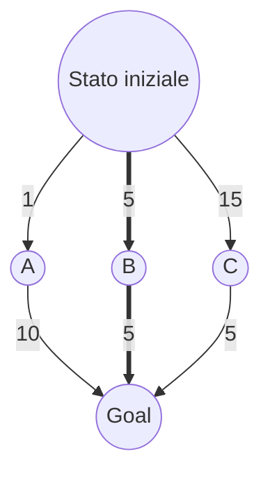

Variante della [[Ricerca in ampiezza]], è una [[Intelligenza Artificiale#Strategie Blind|Strategia Blind]] particolarmente **indicata quando i costi delle azioni non sono tutti uguali**.
Questa strategia **mira ad ottenere una soluzione ottima**, e procede ordinando l'accesso alla frontiera sulla base del costo minimo.
**Ha il problema di entrare in un loop infinito se c'è un loop di costo nullo**.

### Spiegazione esempio
Si consideri $s(c)$ all'interno della frontiera come $s\text{ Stato}, c\text{ Costo}$.      
1. $\text{Frontiera}= \{i(0)\}$ 
   Esploro $i$, non è uno stato obiettivo. Aggiungo in ordine di costo minimo i figli.
   Aggiungo $a,b,c$.
2. $\text{Frontiera}= \{a(1), b(5), c(15)\}$
   Esploro $a$, non è uno stato obiettivo. Aggiungo in ordine di costo minimo i figli.
   $a$ ha come unico figlio $g$, lo aggiungo alla frontiera associandogli il costo per raggiungere $a(1)$ e quello per passare da $a$ a $g$, cioè $10$, ottenendo $g(11)$.
   Aggiungo $g(11)$.
3. $\text{Frontiera}= \{b(5), g(11), c(15)\}$
   Esploro $b$, non è uno stato obiettivo. Aggiungo in ordine di costo minimo i figli.
   $b$ ha come unico figlio $g$: nonostante l'abbiamo già esplorato, l'algoritmo non si cura di ciò, lo aggiunge alla frontiera.
   Aggiungo $g(10)$, costo dato da $i \rightarrow b(5)+b\rightarrow g(5)$.
4. $\text{Frontiera}= \{g(10), g(11), c(15)\}$
   $g$ è uno stato obiettivo!
   **Abbiamo ottenuto il costo minimo**!
## Criteri di valutazione della strategia di ricerca
- **Completezza**: solo se per ogni costo $c$,  $c > 0$.
- **Ottimalità**: solo se per ogni costo $c$,  $c > 0$.
- **Complessità temporale**: $O(b^{1+{\lfloor C^*/\epsilon \rfloor}})$ dove
  - $b$: branching factor
  - $C^*$: costo della soluzione ottima 
  - $c$: costo minimo delle azioni
- **Complessità spaziale**: $O(b^{1+{\lfloor C^*/\epsilon \rfloor}})$

**N.B.** $\lfloor x \rfloor$ significa parte intera inferiore.

In parole è dell’ordine del branching factor elevato al **numero di passi del percorso ottimale se i costi dei passi fossero uniformi**.
Se i costi sono tutti uguali, diventa come la [[Ricerca in ampiezza#Criteri di valutazione della strategia di ricerca|Ricerca in ampiezza]].